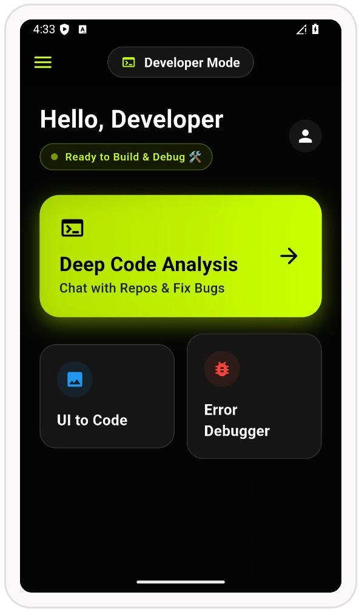
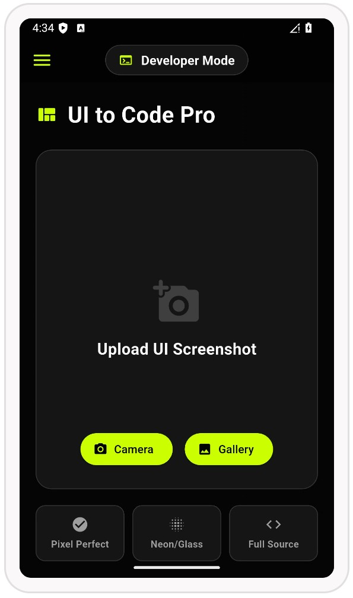
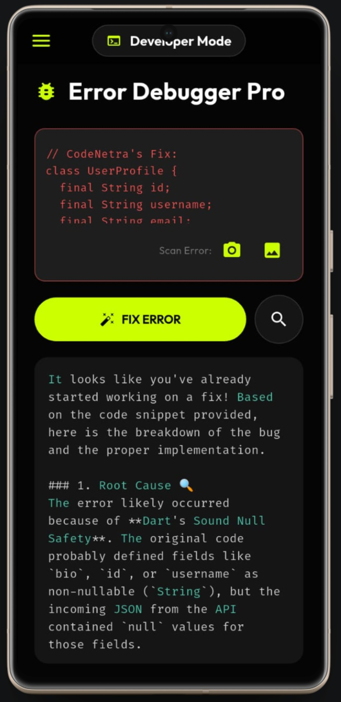

# 👁️ CodeNetra-AI — Gemini 3 Inclusive Vision + Developer Intelligence Suite  
> **Gemini 3 Hackathon Submission**  
> *One Platform. Two Modes. Accessibility + Developer Productivity powered by Gemini 3.*


---

# 🚀 What is CodeNetra-AI?

**CodeNetra-AI is a dual-mode multimodal AI assistant built on Gemini 3.**

It is designed for two high-impact communities:

### 👁️ Netra Vision Mode (Primary Social Impact)
AI-powered “Digital Eyes” for visually impaired users.

### 💻 Developer Mode (Secondary Productivity Showcase)
AI coding intelligence suite for developers using Gemini long-context reasoning.

> **CodeNetra-AI demonstrates Gemini 3’s true power: Vision + Voice + Long Context Reasoning.**

---

# 🔥 Innovation in 3 Lines (Judge Summary)

✅ Real-time Gemini Vision assistant for blind safety  
✅ Repo-level code understanding using Gemini long context (ZIP intelligence)  
✅ UI Screenshot → Working Flutter/React Code generation in seconds  

---

# ⚡ Quick Judge Test (30 Seconds)

Try these instantly:

### 👁️ Netra Vision Mode
- Open **Live Vision**
- Point camera forward  
- Hear real-time narration + hazard alerts  

### 💻 Developer Mode
- Upload a **ZIP repository**
- Ask: *“Explain authentication flow”*  
- Upload a UI screenshot → Get Flutter code instantly  

---

# 🎥 Demo Video

Watch CodeNetra-AI in action:

[](https://youtu.be/MgDoVY6FzvY?si=n8SKYKc8fbE_bf-q)

---

# 🎬 App Screenshots (Proof of Working Product)

| 👁️ Netra Vision Mode | 💻 Developer Mode Dashboard |
|:---:|:---:|
|  |  |
| Accessibility Suite | Coding Intelligence Hub |

| 🎨 UI → Code Engine | 🐞 AI Debug Assistant |
|:---:|:---:|
|  |  |
| Screenshot → Code | Fix Errors Instantly |

---

# 🌍 The Problem

Technology is leaving behind two massive groups:

## 👁️ Accessibility Gap
Millions of visually impaired people struggle with:

- navigating safely  
- reading documents  
- understanding surroundings  
- independence in daily life  

## 💻 Developer Productivity Gap
Developers waste hours on:

- repetitive debugging  
- understanding large repositories  
- converting UI designs into code  
- burnout and slow workflows  

---

# 💡 The Solution: One Suite, Two Modes

CodeNetra-AI solves both with Gemini 3 multimodal intelligence:

- Vision Understanding  
- Voice-First Interface  
- Long Context Code Reasoning  
- Ultra-Fast Flash Responses  

---

# 👁️ Netra Vision Mode — Accessibility Suite (Primary Impact)

Built to empower visually impaired users with **Digital Eyes + Voice Guidance**.

## Key Features

### 🎥 Live Vision (Real-Time World Narration)
Uses Gemini 3 Vision + Camera Stream to:

- detect objects  
- identify hazards  
- narrate surroundings instantly  

Example:  
> “A car is ahead. Please move left.”

---

### 🚗 Live Hazard Detection (Safety Autopilot)
Detects dangers like:

- vehicles  
- obstacles  
- pits  
- unsafe paths  

Triggers:

- Red Alert UI  
- Voice warning: **“सावधान!”**

---

### 💵 Currency Recognition
Identifies Indian Rupee notes instantly for blind accessibility.

---

### 📄 PDF Intelligence
Upload any PDF and Gemini will:

- summarize  
- explain complex text  
- provide spoken narration  

Example:  
> “Explain this PDF in Hindi.”

---

### ❓ Visual Question Answering (VQA)
Capture or upload an image and ask:

- “What is written here?”  
- “What object is this?”  
- “Is this safe?”  

Gemini responds with vision reasoning.

---

### 🎙️ Voice Assistant (Hands-Free Control)
Voice-first interaction for accessibility:

- ask without typing  
- spoken answers  
- full navigation support  

---

### 🙂 Face & Emotion Awareness
Helps blind users understand social cues:

- happy  
- sad  
- angry  
- neutral  

---

# 💻 Developer Mode — AI Coding Productivity Suite

Developer Mode is a **secondary showcase** of Gemini’s long-context reasoning for engineers.

## Key Features

### 📂 Repo Chat (ZIP Intelligence)
Upload an entire `.zip` project repository and ask:

- “Where is login implemented?”  
- “Explain authentication flow”  
- “Summarize this codebase”  

Gemini reads:

- folder structure  
- pubspec.yaml  
- multiple files together  

---

### 🎨 UI → Code Generator
Convert any UI screenshot into:

- Flutter Widgets  
- React Native Components  
- HTML + Tailwind Layouts  
- Python GUI  

Example:  
> “Generate Flutter code for this design.”

---

### 🐞 Error Debugger Pro
Paste any stack trace and Gemini will:

- find root cause  
- explain the issue  
- suggest exact fix + patch  

Example:  
> “Fix this Flutter build error.”

---

### 🏗️ System Architect Assistant
Helps developers design scalable apps:

- architecture guidance  
- clean folder structure  
- best practices  

---

### 🎤 Mock Interview Simulator
AI-powered interview practice:

- real technical questions  
- instant feedback  
- spoken answers  

---

# ⚡ Why Gemini 3?

CodeNetra-AI is built specifically to showcase Gemini 3 strengths:

✅ Multimodal Vision Understanding  
✅ Ultra-Fast Flash Responses  
✅ Long Context Reasoning (1M+ tokens)  
✅ Voice-First Accessibility AI  

Gemini enables both:

- real-world blind assistance  
- deep repository-level code intelligence  

---

# ⭐ What Makes CodeNetra-AI Unique?

Unlike single-purpose AI apps, CodeNetra-AI combines:

- Accessibility + Engineering Productivity  
- Vision + Voice + Reasoning  
- Social Good + Developer Acceleration  

> **A universal AI platform where inclusion meets innovation.**

---

# 🛠️ Tech Stack

| Layer | Technology |
|------|------------|
| Frontend | Flutter (Dart) |
| AI Model | Google Gemini 3 Flash |
| Vision | Camera + Image Picker |
| Voice | Speech-to-Text + Flutter TTS |
| Repo Processing | ZIP Upload + Gemini Long Context |
| Backend (Optional) | Firebase |
| Architecture | Modular Screens + Services |

---
### 🏆 Hackathon Note

CodeNetra-AI is not just a demo — it is a working inclusive AI product demonstrating:

* **Accessibility Innovation:** Real-time help for the visually impaired.
* **Developer Acceleration:** Tools to boost coding speed.
* **Gemini 3 Multimodal Intelligence:** Powered by the latest AI models.
* **✅ Solo Developer Verification:** Please note that commits from users **`roshancodes036-sudo`**, **`sinurai535-a11y`**, and **`Et947`** all belong to the **Sole Creator, Roshan Chaurasiya** (working across different devices).

# 🔐 API Key & Security Setup (Important)

For security reasons, the Gemini API key logic is **not included** in this public repository.

### 🛠️ How to Fix & Run the App:

1. **Get API Key:** Get your free key from [Google AI Studio](https://aistudio.google.com/).
2. **Create File:** Go to `lib/services/` folder and create a new file named **`ai_logic.dart`**.
3. **Paste Code:** Copy and paste the following code into that file (Replace `YOUR_KEY` with your actual key):

```dart
import 'dart:io';
import 'package:google_generative_ai/google_generative_ai.dart';
import 'dart:developer' as developer;

class AIBrain {
  // ✅ User API Key Integration
  static const String _apiKey = "YOUR API KEY HERE";

  late GenerativeModel _model;
  late ChatSession _chat;
  bool _isInitialized = false;

  void initBrain() {
    try {
      _model = GenerativeModel(
        // 🔥 Gemini 3 Flash Preview (Hackathon Special)
        // High speed and low latency for Live Vision
        model: 'gemini-3-flash-preview',
        apiKey: _apiKey,
      );
      _chat = _model.startChat();
      _isInitialized = true;
      developer.log("✅ Netra AI Brain: ACTIVE (Model: gemini-3-flash-preview)");
    } catch (e) {
      developer.log("❌ Brain Error: $e");
    }
  }

  // 🔹 System Instruction (Language + Tone + Safety)
  String get _systemInstruction =>
      " (Reply in the same language as the user (English, Hindi, or Hinglish). Keep the tone professional yet friendly. Use relevant emojis naturally. For blind users, provide concise, safety-first descriptions regarding obstacles, currency, or text.)";

  // 🔥 1. TEXT ONLY CHAT
  Future<String?> askLaravel(String prompt) async {
    try {
      if (!_isInitialized) initBrain();

      // Message + Hidden Instruction
      final content = Content.text(prompt.isNotEmpty
          ? prompt + _systemInstruction
          : "Hello$_systemInstruction");

      final response = await _chat.sendMessage(content);
      return response.text;
    } catch (e) {
      return "Error: ${e.toString()}";
    }
  }

  // 🔥 2. IMAGE + TEXT CHAT (Camera/Gallery)
  Future<String?> askWithImage(String prompt, File imageFile) async {
    try {
      if (!_isInitialized) initBrain();

      // Convert image to bytes
      final imageBytes = await imageFile.readAsBytes();

      // Prepare Content (Text + Image)
      final content = Content.multi([
        TextPart(prompt.isEmpty
            ? "Explain this image in detail for a visually impaired person.$_systemInstruction"
            : prompt + _systemInstruction),
        DataPart('image/jpeg', imageBytes),
      ]);

      // Send to Gemini 3
      final response = await _model.generateContent([content]);
      return response.text;
    } catch (e) {
      return "Image Error: ${e.toString()}";
    }
  }

  void stopSpeaking() {
    // Future scope for stopping TTS
  }
}

⚡ Run Locally
1. Clone Repository
git clone https://github.com/roshancodes036-sudo/CodeNetra-Flutter-AI.git
cd CodeNetra-Flutter-AI

2. Install & Run
flutter pub get
flutter run

👨‍💻 Author

Roshan Chaurasiya
📍 Varanasi, India

Built with ❤️ to demonstrate the real-world impact of Gemini 3.


