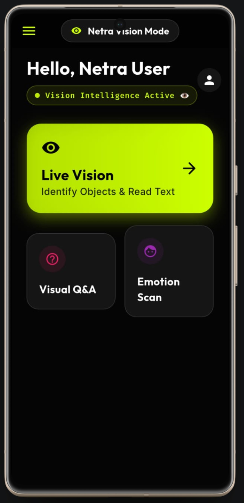

# 👁️ Netra Assist — Inclusive Vision & Accessibility Suite  
> **GNEC Hackathon 2026 Spring Submission** > *Empowering Vision with AI. Built for UN SDG 3 (Health & Well-being).*


---

# 🚀 What is Netra Assist?

**Netra Assist is an advanced multimodal AI accessibility super-app.**

It is designed entirely around **UN SDG 3 (Good Health and Well-being)** to serve as AI-powered “Digital Eyes” for visually impaired individuals. By leveraging state-of-the-art vision and voice models, it helps users navigate the world safely and independently.

> **Netra Assist demonstrates the true power of AI for Social Good: Vision + Voice + Instant Reasoning.**

---

# 🔥 Innovation in 3 Lines (Judge Summary)

✅ Real-time Vision assistant for blind safety & independent navigation.  
✅ Multimodal hazard detection, PDF reading, and Emotion scanning.  
✅ 100% Voice-First, accessible UI designed specifically for visually impaired users.  

---

# ⚡ Quick Judge Test (30 Seconds)

Try these instantly to experience the impact:

### 👁️ Netra Vision Mode
- Open **Live Vision**
- Point camera forward at objects or text 
- Hear real-time narration + hazard alerts instantly 

---

# 🎥 Demo Video

Watch Netra Assist in action (Click below):

[](https://www.youtube.com/watch?v=MgDoVY6FzvY)

> *Click the image above to watch the full demo breakdown.*

---

# 📸 App Screenshots (Proof of Working Product)

| 👁️ Netra Assist Dashboard | 🎥 Live Vision AI |
|:---:|:---:|
|  |  |
| *Accessibility Suite for the Blind* | *Real-Time Object & Text Recognition* |

| 📄 PDF Intelligence | 🙂 Emotion & Face Scan |
|:---:|:---:|
|  |  |
| *Reads & Explains Documents aloud* | *Understand Social Cues via AI* |

---

# 🌍 The Problem (Why SDG 3?)

Technology is advancing, but it is leaving behind a massive vulnerable group:

## 👁️ The Accessibility Gap
Millions of visually impaired people struggle daily with:
- Navigating safely in public spaces
- Reading physical documents or digital PDFs
- Understanding their surroundings and social cues
- Maintaining independence in daily life

---

# 💡 The Solution: Netra Assist

Netra Assist solves these critical challenges using multimodal AI intelligence:
- **Vision Understanding** (Object detection & text reading)
- **Voice-First Interface** (No complex typing needed)
- **Ultra-Fast Responses** (Crucial for real-time safety)

---

# ⭐ Key Features

### 🎥 Live Vision (Real-Time World Narration)
Uses AI Vision + Camera Stream to:
- Detect objects in real-time
- Identify hazards in the user's path
- Narrate surroundings instantly via TTS

Example:  
> *“A car is ahead. Please move left.”*

---

### 🚗 Live Hazard Detection (Safety Autopilot)
Detects physical dangers like:
- Moving vehicles
- Obstacles and pits
- Unsafe walking paths

Triggers: Voice warning: **“सावधान! (Caution!)”**

---

### 💵 Currency Recognition
Identifies Indian Rupee notes instantly to prevent fraud and help in daily transactions.

---

### 📄 PDF Intelligence
Upload any PDF and the AI will:
- Summarize long text
- Explain complex documents
- Provide spoken narration in native languages

---

### ❓ Visual Question Answering (VQA)
Capture an image and ask:
- “What is written on this medicine bottle?”  
- “Is this path safe to walk?”  
The AI responds with precise visual reasoning.

---

### 🎙️ Voice Assistant (Hands-Free Control)
Complete voice-first interaction for ultimate accessibility:
- Ask without typing
- Spoken answers for all queries
- Full navigation support

---

### 🙂 Face & Emotion Awareness
Helps blind users understand social interactions by scanning faces and detecting emotions:
- Happy, Sad, Angry, or Neutral.

---

# 🛠️ Tech Stack

| Layer | Technology |
|------|------------|
| Frontend | Flutter (Dart) |
| AI Model | Google Gemini Flash |
| Vision | Camera + Image Picker |
| Voice | Speech-to-Text + Flutter TTS |
| Document Processing | Syncfusion PDF + Markdown |
| Backend (Optional) | Firebase |

---
### 🏆 Hackathon Note

Netra Assist is a working, inclusive AI product demonstrating real-world impact for **SDG 3 (Health and Well-being)**. 

* **Accessibility Innovation:** Real-time help for the visually impaired.
* **Social Good:** Using cutting-edge tech to solve human-centric problems.
* **✅ Solo Developer Verification:** Please note that all commits from user **`roshancodes036-sudo`** belong to the **Sole Creator, Roshan Chaurasiya**.

---

# 🔐 API Key & Security Setup (Important)

For security reasons, the API key logic is **not included** in this public repository.

### 🛠️ How to Fix & Run the App:

1. **Get API Key:** Get your free key from [Google AI Studio](https://aistudio.google.com/).
2. **Create File:** Go to `lib/services/` folder and create a new file named **`ai_logic.dart`**.
3. **Paste Code:** Copy and paste the following code into that file (Replace `YOUR_KEY` with your actual key):

```dart
import 'dart:io';
import 'package:google_generative_ai/google_generative_ai.dart';
import 'dart:developer' as developer;

class AIBrain {
  // ✅ User API Key Integration
  static const String _apiKey = "YOUR API KEY HERE";

  late GenerativeModel _model;
  late ChatSession _chat;
  bool _isInitialized = false;

  void initBrain() {
    try {
      _model = GenerativeModel(
        // 🔥 Fast model for real-time Live Vision
        model: 'gemini-1.5-flash',
        apiKey: _apiKey,
      );
      _chat = _model.startChat();
      _isInitialized = true;
      developer.log("✅ Netra AI Brain: ACTIVE");
    } catch (e) {
      developer.log("❌ Brain Error: $e");
    }
  }

  // 🔹 System Instruction (Language + Tone + Safety)
  String get _systemInstruction =>
      " (Reply in the same language as the user (English, Hindi, or Hinglish). Keep the tone professional yet friendly. Use relevant emojis naturally. For blind users, provide concise, safety-first descriptions regarding obstacles, currency, or text.)";

  // 🔥 1. TEXT ONLY CHAT
  Future<String?> askNetra(String prompt) async {
    try {
      if (!_isInitialized) initBrain();

      // Message + Hidden Instruction
      final content = Content.text(prompt.isNotEmpty
          ? prompt + _systemInstruction
          : "Hello$_systemInstruction");

      final response = await _chat.sendMessage(content);
      return response.text;
    } catch (e) {
      return "Error: ${e.toString()}";
    }
  }

  // 🔥 2. IMAGE + TEXT CHAT (Camera/Gallery)
  Future<String?> askWithImage(String prompt, File imageFile) async {
    try {
      if (!_isInitialized) initBrain();

      // Convert image to bytes
      final imageBytes = await imageFile.readAsBytes();

      // Prepare Content (Text + Image)
      final content = Content.multi([
        TextPart(prompt.isEmpty
            ? "Explain this image in detail for a visually impaired person.$_systemInstruction"
            : prompt + _systemInstruction),
        DataPart('image/jpeg', imageBytes),
      ]);

      // Send to AI
      final response = await _model.generateContent([content]);
      return response.text;
    } catch (e) {
      return "Image Error: ${e.toString()}";
    }
  }

  void stopSpeaking() {
    // Future scope for stopping TTS
  }
}

⚡ Run Locally
1. Clone Repository
git clone [https://github.com/roshancodes036-sudo/Netra-Assist-AI.git](https://github.com/roshancodes036-sudo/Netra-Assist-AI.git)
cd Netra-Assist-AI

2. Install & Run
flutter pub get
flutter run
👨‍💻 Author Roshan Chaurasiya 📍 Ghazipur, India
Built with ❤️ to demonstrate the real-world impact of AI for Social Good.

